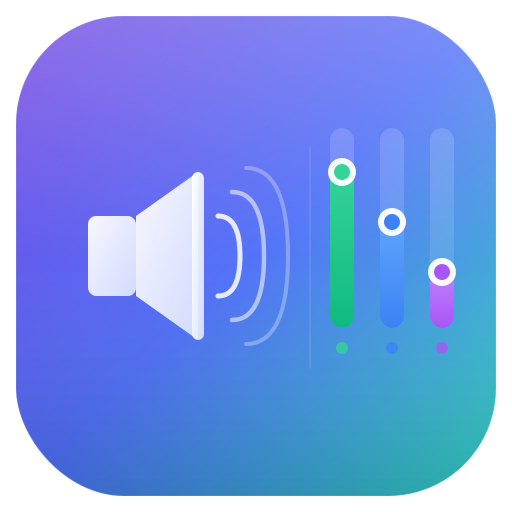

# VibeFader

Per-app volume control for macOS.



## What it does

VibeFader sits in your menu bar and lets you independently control the volume of each app on your Mac. Lower Spotify while keeping Discord loud, mute a browser tab's audio without touching the system volume — that kind of thing.

## How it works

VibeFader uses the **Core Audio Tap API** (macOS 14.2+) — no virtual audio drivers, no kernel extensions, no jank.

1. A **muting tap** intercepts each app's audio stream
2. An **IOProc** reads the captured audio into a ring buffer
3. An **AVAudioEngine** plays it back at your chosen volume

Taps run continuously for all detected audio apps with passthrough at 100% by default. No audio quality loss, minimal latency.

## Requirements

- **macOS 14.2** (Sonoma) or later
- **Xcode 16+** (to build from source)
- [XcodeGen](https://github.com/yonaskolb/XcodeGen) (`brew install xcodegen`)

## Install

```bash
git clone https://github.com/le-big-mac/vibefader.git
cd vibefader
./build.sh
```

This builds a Release binary, copies it to `/Applications/VibeFader.app`, and sets up the required permissions.

### Permissions

VibeFader needs **Audio Capture** permission to intercept app audio. The build script automatically grants this by inserting `kTCCServiceAudioCapture` into your user TCC database via `sqlite3`. This is necessary because macOS does not auto-prompt for this permission — manually granting "Screen & System Audio Recording" in System Settings is often not sufficient on its own.

You should also grant **Screen & System Audio Recording** permission in:
**System Settings → Privacy & Security → Screen & System Audio Recording**

> **Note:** The build script modifies `~/Library/Application Support/com.apple.TCC/TCC.db` to grant the audio capture permission. This is the same database macOS uses to track your privacy choices. The entry can be removed with: `sqlite3 "$HOME/Library/Application Support/com.apple.TCC/TCC.db" "DELETE FROM access WHERE client='com.chadon.VibeFader' AND service='kTCCServiceAudioCapture'"`

## Usage

1. Launch VibeFader — it appears as a slider icon in your menu bar
2. Click it to see all apps with audio sessions
3. Drag a slider to adjust that app's volume
4. Click the speaker icon next to an app to mute/unmute it
5. Use the output device picker at the bottom to switch audio output

## Building from source

```bash
# Generate the Xcode project
xcodegen generate

# Build Release
xcodebuild -project VibeFader.xcodeproj \
  -scheme VibeFader \
  -configuration Release \
  CODE_SIGNING_ALLOWED=NO \
  build
```

Or open `VibeFader.xcodeproj` in Xcode and build from there.

## Architecture

```
VibeFader/
├── VibeFaderApp.swift          # Menu bar app entry point
├── Audio/
│   ├── AppAudioController.swift    # Per-app tap + ring buffer + engine
│   ├── AudioManager.swift          # Coordinator (ObservableObject)
│   ├── AudioDeviceManager.swift    # Output device enumeration
│   ├── AudioProcessDiscovery.swift # Find apps with audio sessions
│   └── CoreAudioHelpers.swift      # Low-level Core Audio wrappers
├── Models/
│   └── AudioApp.swift              # App model (pid, name, icon, volume)
└── Views/
    ├── VolumePopoverView.swift     # Main popover
    ├── AppVolumeRow.swift          # Per-app slider row
    └── OutputDevicePicker.swift    # Output device selector
```

The core audio pipeline in `AppAudioController`:
- `CATapDescription` → `AudioHardwareCreateProcessTap` (intercept app audio)
- Tap-only aggregate device → `AudioDeviceCreateIOProcIDWithBlock` (capture to ring buffer)
- `AVAudioSourceNode` → `AVAudioEngine` (play back at controlled volume)

## Known limitations

- **FaceTime, Zoom, Teams** — These apps route audio through system daemons (`avconferenced`, `callservicesd`) rather than their own process. The Core Audio Tap API can only tap the process that owns the audio, so VoIP apps aren't controllable with this approach.
- **macOS 14.2+ only** — The Core Audio Tap API was introduced in macOS 14.2 Sonoma.
- **Permission setup** — Requires `kTCCServiceAudioCapture` which macOS doesn't auto-prompt for. The build script handles this via direct TCC database insertion.

## Disclaimer

**This entire app was vibe-coded.** Every line of code was written by [Claude Code](https://claude.ai/code) (Claude Opus 4.6) in a single session. No human wrote any code. The name "VibeFader" reflects both what it does (fade audio levels) and how it was made (vibes).

It works on the author's machine. It might work on yours. It interacts with low-level Core Audio APIs and your system's TCC permission database. Use at your own risk.

## License

[MIT](LICENSE)
